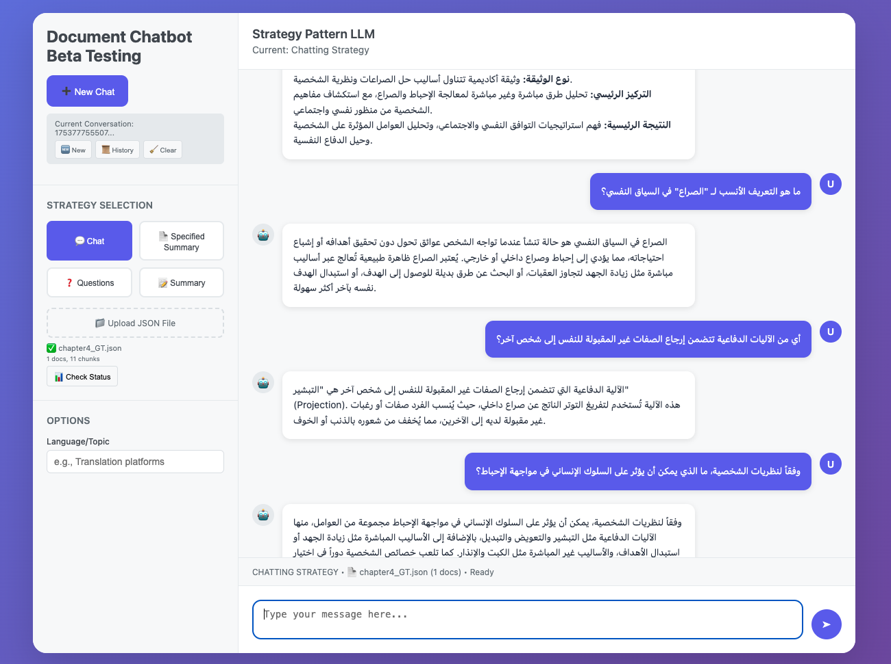

# 🧠 Multilingual Document Chatbot

<p align="center">
  
</p>

> **⚠️ This platform is for beta, development, and testing purposes only. It is not intended for production use.**

A sophisticated AI-powered multilingual **Document Chatbot** that leverages **Retrieval-Augmented Generation (RAG)** technology. Built with a **Strategy Pattern** architecture, it integrates LLMs and embedding models to provide intelligent document analysis, summarization, and conversational AI capabilities.

## ✨ Features

- 🌍 **Multilingual Support**: Automatic language detection and response generation
- 📚 **Document Processing**: Support for JSON Files
- 🔍 **Advanced RAG**: FAISS vector store with semantic search and reranking in chatting and topic specific summary
- 💬 **Conversational AI**: Context-aware chat with conversation history in chatting strategy
- 📊 **Multiple Strategies**: Chat, summarization, question generation, and keyword-based search
- ⚙️ **Configurable**: Environment-based configuration system
- 🚀 **Production Ready**: Docker support with comprehensive logging
- 🎨 **Web Interface**: Clean, responsive frontend for easy interaction

---

## 🚀 Quick Start

### Prerequisites

- Python 3.12+
- [Ollama](https://ollama.com) installed and running
- CUDA or MPS support  

### 1. Clone and Setup

```bash
git clone https://github.com/maryamabdallahmohamed/Document_Chatbot
cd document-chatbot
pip3 install -r requirements.txt
```

### 2. Start Ollama Server

```bash
# Start Ollama server
ollama serve

# In another terminal, pull the required models
ollama pull qwen3:8b
```

### 3. Configuration (Optional)

Copy the example environment file and customize settings:

```bash
cp .env.example .env
# Edit .env with your preferred settings
```

### 4. Launch the Application

```bash
python api_server.py
```

The application will be available at **[http://localhost:5050](http://localhost:5050)**

---

## 📋 Configuration

The application uses a comprehensive configuration system that supports environment variables for easy deployment customization.

### Environment Variables

| Category | Variable | Default | Description |
|----------|----------|---------|-------------|
| **Models** | `EMBEDDING_MODEL` | `sentence-transformers/all-MiniLM-L6-v2` | Embedding model for document processing |
| | `BATCH_SIZE` | `32` | Batch size for embedding generation |
| | `DEFAULT_LLM_MODEL` | `llama3:8b` | Primary LLM model |
| | `QWEN3_MODEL` | `qwen3:8b` | Alternative LLM model |
| | `RERANKER_MODEL` | `BAAI/bge-reranker-v2-m3` | Reranking model for improved retrieval |
| **Processing** | `CHUNK_SIZE` | `200` | Document chunk size for processing |
| | `CHUNK_OVERLAP` | `50` | Overlap between document chunks |
| | `DEFAULT_TOP_K` | `5` | Number of documents to retrieve |
| | `FUZZY_THRESHOLD` | `70` | Fuzzy matching threshold for keyword search |
| **API Server** | `API_HOST` | `0.0.0.0` | Server host address |
| | `API_PORT` | `5050` | Server port |
| | `API_DEBUG` | `True` | Enable debug mode |
| **Upload** | `UPLOAD_FOLDER` | `data` | Directory for uploaded files |
| | `MAX_UPLOAD_SIZE` | `16777216` | Maximum upload size (16MB) |
| **System** | `LOG_LEVEL` | `INFO` | Logging level |
| | `CONVERSATION_HISTORY_LIMIT` | `6` | Conversation history context limit |
| | `SECRET_KEY` | `your-secret-key-change-in-production` | Flask secret key |

### Configuration Example

Create a `.env` file in the project root:

```env
# Model Configuration
EMBEDDING_MODEL=sentence-transformers/all-MiniLM-L6-v2
DEFAULT_LLM_MODEL=llama3:8b
BATCH_SIZE=64

# API Configuration
API_PORT=8080
API_DEBUG=False

# Processing Configuration
CHUNK_SIZE=300
DEFAULT_TOP_K=10

# Production Settings
LOG_LEVEL=WARNING
SECRET_KEY=your-production-secret-key
```

---

## 💻 Usage Guide

### Web Interface

1. **Upload Documents**: Use the web interface to upload JSON files.
2. **Select Strategy**: Choose from available processing strategies
3. **Interact**: Ask questions, request summaries, or generate questions

### Available Strategies

#### 1. **Chat Strategy** (`chatting_strategy`)
Interactive conversational AI with document context and history.

```json
{
  "strategy": "chatting_strategy",
  "message": "What are the main findings in this document?",
  "conversation_id": "unique-session-id"
}
```

#### 2. **Summarization Strategy** (`summarization`)
Generate comprehensive document summaries.

```json
{
  "strategy": "summarization",
  "message": "",
  "options": {
    "length": "medium",
    "verbose": true,
    "overview_level": "high_level"
  }
}
```

**Length Options**: `short`, `medium`, `long`
**Overview Levels**: `low_level`, `mid_level`, `high_level`

#### 3. **Question Generation** (`question_strategy`)
Generate questions based on document content.

```json
{
  "strategy": "question_strategy",
  "message": "",
  "options": {
    "count": 10,
    "type": "hard"
  }
}
```

**Question Types**: `easy`, `medium`, `hard`

#### 4. **Keyword-based RAG** (`rag_summary`)
Targeted information retrieval using keywords.

```json
{
  "strategy": "rag_summary",
  "message": "market analysis",
  "options": {
    "keywords": "market analysis trends"
  }
}
```

### API Endpoints

#### Upload Document
```bash
curl -X POST http://localhost:5050/api/upload \
  -F "file=@document.json"
```

#### Process Message
```bash
curl -X POST http://localhost:5050/api/process \
  -H "Content-Type: application/json" \
  -d '{
    "strategy": "chatting_strategy",
    "message": "Summarize the key points",
    "conversation_id": "session-123"
  }'
```

#### System Status
```bash
curl http://localhost:5050/api/status
```

---

## 🐳 Docker Deployment

### Basic Deployment

```bash
# Build and start the application
docker-compose up --build -d

# View logs
docker-compose logs -f api-server

# Stop the application
docker-compose down
```

### With Redis (Optional)

```bash
# Start with Redis for enhanced caching
docker-compose --profile redis up --build -d
```

### Development Mode

```bash
# Quick restart after code changes
docker-compose restart api-server

# Rebuild after dependency changes
docker-compose build api-server && docker-compose up -d api-server
```

### Troubleshooting

```bash
# Access container for debugging
docker-compose exec api-server bash

# Check container status
docker-compose ps

# View detailed logs
docker-compose logs -f --tail=100 api-server
```

---

## 🏗 Architecture

### System Overview

The application follows a modular, strategy-pattern architecture that separates concerns and allows for easy extension and maintenance.

### Core Components

#### **Strategy Pattern Architecture**
- `TaskProcessor`: Orchestrates strategy execution
- `TaskStrategy`: Abstract base for all processing strategies
- Interchangeable strategies for different use cases

#### **Document Processing Pipeline**
1. **Input**: JSON/TXT/PDF files via upload
2. **Preprocessing**: `JSONPreprocessor` with configurable chunking
3. **Embedding**: `MultilingualEmbedder` using sentence-transformers
4. **Storage**: FAISS vector store for efficient similarity search
5. **Retrieval**: Semantic search with optional reranking
6. **Generation**: LLM response via Ollama integration

#### **API Layer**
- **Flask Server**: RESTful API with CORS support
- **File Management**: Secure upload handling with size limits
- **Session Management**: Conversation history tracking
- **Frontend Integration**: Serves static files and API endpoints

### Directory Structure

```
document-chatbot/
├── 📁 src/                          # Core application code
│   ├── 📁 abstracts/               # Abstract base classes
│   │   ├── abstract_embedder.py    # Embedding interface
│   │   ├── abstract_llm.py         # LLM interface
│   │   ├── abstract_task_strategy.py # Strategy pattern base
│   │   └── abstract_vector_db.py   # Vector store interface
│   ├── 📁 core/                    # Core system components
│   │   ├── chat_history_manager.py # Conversation management
│   │   └── task_processor.py       # Strategy orchestration
│   ├── 📁 models/                  # AI model implementations
│   │   ├── llm_models.py          # LLM wrapper classes
│   │   ├── multilingual_embedder.py # Embedding model
│   │   └── reranker.py            # Document reranking
│   ├── 📁 processors/              # Document processing
│   │   ├── base_preprocessor.py   # Base preprocessing logic
│   │   └── json_processor.py      # JSON document handler
│   ├── 📁 strategies/              # Processing strategies
│   │   ├── chat_strategy.py       # Conversational AI
│   │   ├── question_strategy.py   # Question generation
│   │   └── summarization_strategy.py # Document summarization
│   └── 📁 vectorstores/           # Vector storage
│       └── faiss_vectorstore.py   # FAISS implementation
├── 📁 config/                      # Configuration files
│   ├── 📁 prompts/                # LLM prompt templates
│   │   └── summarization_prompts.yaml
│   ├── language_detect.py         # Language detection
│   └── settings.py               # Application settings
├── 📁 frontend/                   # Web interface
│   └── index.html                # Main UI
├── 📁 data/                      # Uploaded documents
├── 📁 cache/                     # Model and embedding cache
├── 📁 logs/                      # Application logs
├── 📁 vectorstore/               # Vector database files
├── api_server.py                 # Main Flask application
├── bot.py                       # Standalone processing script
├── requirements.txt             # Python dependencies
├── dockerfile                   # Docker configuration
├── docker-compose.yml          # Docker Compose setup
└── .env.example                # Environment configuration template
```

---

## 🔧 Development

### Setting Up Development Environment

```bash
# Clone repository
git clone https://github.com/maryamabdallahmohamed/Document_Chatbot
cd document-chatbot

# Create virtual environment
python -m venv venv
source venv/bin/activate  # On Windows: venv\Scripts\activate

# Install dependencies
pip install -r requirements.txt

# Copy environment configuration
cp .env.example .env
```

### Running Tests

```bash
# Run the standalone bot script
python bot.py

# Test API endpoints
curl http://localhost:5050/api/status
```

### Adding New Strategies

1. Create a new strategy class inheriting from `TaskStrategy`
2. Implement the required methods (`run`, `validate_input`)
3. Register the strategy in `api_server.py`
4. Add configuration options in `settings.py`

Example:

```python
# src/strategies/my_strategy.py
from src.abstracts.abstract_task_strategy import TaskStrategy

class MyStrategy(TaskStrategy):
    def __init__(self, llm):
        self.llm = llm
    
    def validate_input(self, input_data):
        return isinstance(input_data, str) and len(input_data.strip()) > 0
    
    def run(self, input_data):
        # Your strategy implementation
        return self.llm.invoke(input_data)
```

### Logging and Monitoring

The application provides comprehensive logging with emoji indicators:

- 🚀 System startup and initialization
- 📁 Document loading and processing
- 🧠 Model loading and inference
- 💬 Chat interactions and responses
- ❌ Errors and warnings
- ✅ Successful operations

Logs are written to:
- Console output (with colors)
- `logs/api_server.log` (API server logs)
- `logs/document_processing.log` (document processing logs)
- `logs/conversation_history/` (chat sessions)

---

## 🚀 Production Deployment

### Environment Setup

1. **Create production environment file**:
```env
# Production .env
API_DEBUG=False
LOG_LEVEL=WARNING
SECRET_KEY=your-secure-production-key
MAX_UPLOAD_SIZE=52428800  # 50MB
```

2. **Security considerations**:
   - Change default secret key
   - Implement proper authentication if needed
   - Configure firewall rules
   - Use HTTPS in production
   - Set appropriate file upload limits

### Docker Production Deployment

```bash
# Production docker-compose override
version: "3.8"
services:
  api-server:
    environment:
      - API_DEBUG=False
      - LOG_LEVEL=WARNING
    restart: always
```

### Performance Optimization

- **GPU Support**: Enable CUDA for faster model inference
- **Model Caching**: Persistent volume mounts for model cache
- **Load Balancing**: Multiple container instances behind a load balancer
- **Database**: Consider PostgreSQL for conversation history in high-load scenarios

---

## 🔍 Troubleshooting

### Common Issues

#### **Model Loading Errors**
```bash
# Ensure Ollama is running and models are available
ollama list
ollama pull llama3:8b
```

#### **Memory Issues**
- Reduce `BATCH_SIZE` in configuration
- Use CPU-only mode if GPU memory is insufficient
- Increase Docker memory limits

#### **Upload Failures**
- Check `MAX_UPLOAD_SIZE` configuration
- Verify file permissions in upload directory
- Ensure supported file formats (JSON, TXT, PDF)

#### **Connection Issues**
```bash
# Check if services are running
curl http://localhost:5050/api/status

# Check container logs
docker-compose logs api-server
```

### Debug Mode

Enable debug mode for detailed logging:

```env
API_DEBUG=True
LOG_LEVEL=DEBUG
```

---

## 📊 Performance Metrics


### Optimization Tips

1. **Batch Processing**: Increase batch size for better throughput
2. **Model Selection**: Choose smaller models for faster inference
3. **Chunk Size**: Optimize chunk size for your document types
4. **Caching**: Enable persistent model caching
5. **Hardware**: Use GPU acceleration when available

---

## 🤝 Contributing

We welcome contributions! Please follow these guidelines:

### Development Workflow

1. **Fork the repository**
2. **Create a feature branch**: `git checkout -b feature/amazing-feature`
3. **Make your changes** following the existing code style
4. **Add tests** for new functionality
5. **Update documentation** as needed
6. **Submit a pull request**

### Code Style

- Follow PEP 8 conventions
- Use meaningful variable names
- Add docstrings to functions and classes
- Include type hints where appropriate
- Use the existing logging patterns with emoji indicators

### Pull Request Guidelines

- Provide a clear description of changes
- Include tests for new features
- Update documentation
- Ensure all tests pass
- Follow the existing commit message format

---

## 📜 License

This project is licensed under the MIT License. See the [LICENSE](LICENSE) file for details.

---

## 🙏 Acknowledgments

- **Langchain**: Framework for LLM applications
- **Sentence Transformers**: Pre-trained embedding models
- **FAISS**: Efficient similarity search library
- **Ollama**: Local LLM inference engine
- **Flask**: Web framework for API development

---

## 📞 Support

For questions, issues, or contributions:

1. **Issues**: Open a GitHub issue with detailed information
2. **Discussions**: Use GitHub Discussions for general questions
3. **Documentation**: Check this README and inline code documentation

---

<p align="center">
  <b>🚀 Happy Chatting with your Documents! 🚀</b>
</p>
